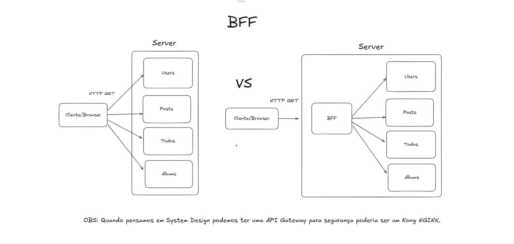

## BFF (Backend for Frontend)

O cliente faz uma chamada ao BFF. O BFF, por sua vez, realiza múltiplas requisições aos serviços necessários, processa os dados e retorna uma única resposta consolidada para o cliente. Sem o BFF, o cliente precisaria lidar diretamente com múltiplos serviços, o que aumentaria a complexidade, o consumo de rede e o risco de lentidão.

## Tecnologias Utilizadas 📎
- [React](https://react.dev/)
- [Vite](https://vite.dev/)
- [NestJS](https://nestjs.com/)
- [JSONPlaceholder](https://jsonplaceholder.typicode.com/)
- [Excalidraw](https://excalidraw.com/)

## Pré-requisitos 📝

Para rodar este projeto é necessário ter instalado na sua máquina as seguintes tecnologias:

- É necessário possuir o [Node.js](https://nodejs.org/en/) instalado na máquina.
- Também, é preciso ter um gerenciador de pacotes seja [Yarn](https://yarnpkg.com/) ou [Npm](https://www.npmjs.com/).

## Para rodar o projeto front-bff 📌

1. Escolher o emulador da sua preferência.
2. Instale as dependências: `yarn` ou `npm install`
3. Startar a aplicação: `yarn dev` ou `npm run dev`

## Para rodar o projeto back-bff 📌

1. Escolher o emulador da sua preferência.
2. Instale as dependências: `npm install`
3. Startar a aplicação: `npm run start`

## Excalidraw 📷

    

---

- [Inspired by](https://www.youtube.com/watch?v=diAtYBfKRuY)
